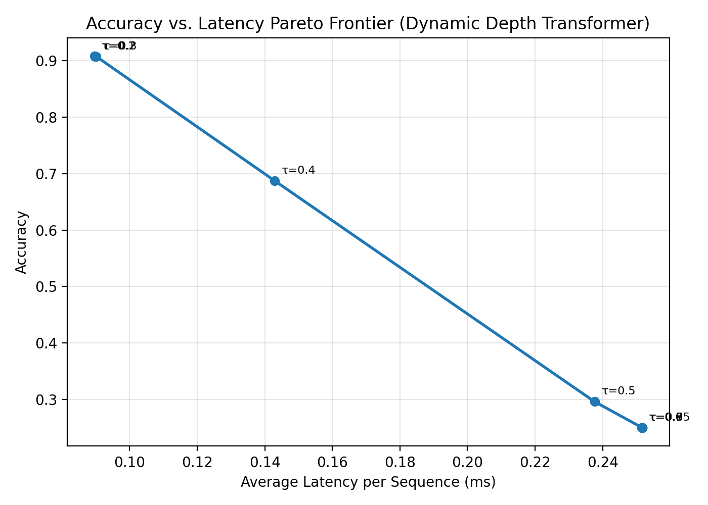

# Dynamic Depth Transformer: Latency-Aware Soft-Routing for Early Exit

Standard Transformers spend the same compute on "the" as on the hardest token in a mathematical proof. This project implements a **token-level early-exit Transformer** that learns *how deep* each token needs to go through the network, trained end-to-end with a **Gumbel-Softmax router** and a **hardware latency-aware joint loss** — no hand-crafted heuristics, no separate distillation stage, just a differentiable routing signal baked directly into training.

---

## Table of Contents

- [Core Idea](#core-idea)
- [Joint Objective](#joint-objective)
- [Results](#results-ag-news-24-layer-model-d_model256-trained-8-epochs)
- [Reasoning & Design Decisions](#reasoning--design-decisions)
- [Limitations & Future Work](#limitations--future-work)
- [Project Structure](#project-structure)
- [Usage](#usage)
- [Implementation Notes](#implementation-notes)
- [Tech Stack](#tech-stack)

---

## Core Idea

A lightweight binary router is placed after every 4th Transformer block. At each checkpoint, the router predicts `P(exit)` for every token independently. During training, a **Straight-Through Gumbel-Softmax estimator** makes this discrete exit/continue decision differentiable, so gradients from the downstream classification loss can flow back and shape routing behavior. At inference, tokens exit deterministically once `P(exit)` crosses a threshold **τ**, freezing their representation and skipping all remaining layers — no wasted compute on tokens the model is already confident about.

Token x ──► [Layer 1] ──► [Router 1] ──► (Exit Decision?) ──► Final Classification
│ (No)
▼
[Layer 2] ──► [Router 2] ──► ...


Each token in a sequence is routed **independently** — a short, common word can exit after 4 layers while a named entity or ambiguous term in the same sentence continues to layer 24. This is the key departure from sequence-level early exit (where the whole input either exits or doesn't): it lets the model allocate compute at the granularity where difficulty actually varies.

## Joint Objective

L_total = L_CE + γ · Σ_{i=1}^{L} (i · P_exit,i)


The cross-entropy term drives classification accuracy as usual. The latency term directly charges the model a cost proportional to *how deep* it sends each token — exiting at layer 20 costs 5x more penalty than exiting at layer 4. This means the model isn't just learning to classify; it's learning a **cost-aware policy** that trades off compute against confidence, entirely through gradient descent on a single unified loss.

---

## Results (AG News, 24-layer model, d_model=256, trained 8 epochs)

At the optimal operating point (**τ = 0.2**):

| Metric | Value |
|---|---|
| Accuracy | **90.79%** |
| Avg. layers traversed (all tokens) | 8.57 / 24 |
| Avg. layers — easy tokens (bottom 25%) | **4.00** |
| Avg. layers — hard tokens (top 25%) | **22.46** |
| FLOPs saved vs. dense baseline | **64.31%** |



### Accuracy vs. Latency Sweep

| τ (exit threshold) | Accuracy | Avg. Layers | FLOPs Saved |
|---|---|---|---|
| 0.10 | 90.80% | 8.54 | 64.4% |
| 0.20 | 90.79% | 8.57 | 64.3% |
| 0.30 | 90.78% | 8.59 | 64.2% |
| 0.40 | 68.75% | 13.63 | 43.2% |
| 0.50 | 29.59% | 22.66 | 5.6% |
| ≥0.60 | ~25.00% | 24.00 | 0.0% |

The frontier's sweet spot sits at low τ (0.1–0.3): the model reaches **90.8% accuracy using barely a third of the network's depth**, and accuracy stays essentially flat across that whole range while FLOPs savings stay pinned near 64% — a wide, stable operating region rather than a narrow knife-edge tradeoff. This is the practically useful part of the frontier: a deployer can pick any τ in [0.1, 0.3] and get the same accuracy at the same compute cost, with no fine-tuning required.

---

## Reasoning & Design Decisions

**Why token-level routing, not layer-level or sequence-level?**
Sequence-level early exit (the whole input exits together) wastes the opportunity that most of the difficulty variance in language lives *within* a sequence, not just across sequences. A sentence like "Apple reported record iPhone revenue" has "reported" and "iPhone" needing very different amounts of contextual reasoning. Token-level routing captures this directly.

**Why Gumbel-Softmax instead of REINFORCE or a fixed heuristic?**
The exit decision is fundamentally discrete (a token either continues or it doesn't), but discrete decisions block gradient flow. REINFORCE-style policy gradients work but are high-variance and slow to converge. The Straight-Through Gumbel-Softmax estimator gives a low-variance, fully differentiable path: forward pass is (approximately) discrete, backward pass uses the continuous relaxation's gradient. This lets the router train with the same optimizer, same loss surface, and same stability guarantees as the rest of the network — no separate RL loop.

**Why batched masking instead of physically shortening tensors?**
Physically removing exited tokens mid-batch would require ragged tensors or per-token dynamic batching, which is complex to implement efficiently and doesn't parallelize well on GPU. Instead, this implementation keeps every tensor fully batched and rectangular throughout training; exited tokens are masked and their hidden state frozen (not updated by subsequent layers), while an exact per-token layer-count is tracked in parallel. This gives GPU-efficient training *and* exact, not estimated, compute-accounting at evaluation time — the FLOPs and latency numbers reported are computed from real per-token traversal counts, not approximations.

**Why AG News?**
A 4-class topic classification task with short, single-sentence inputs is ideal for a first proof-of-concept: it's fast to train (no need for a huge model or dataset to see the routing behavior emerge), has a natural mix of lexically trivial headlines ("Stocks rise today") and genuinely ambiguous ones requiring named-entity and numeric reasoning, and gives a clean accuracy metric for the Pareto frontier.

---

## Limitations & Future Work

Pushing τ above ~0.4 causes accuracy to **collapse toward chance (25%, i.e. 1/4 classes)** rather than degrading gracefully — this is the most important finding from this project and worth stating plainly rather than hiding.

**Root cause:** because the router uses *hard* Gumbel-Softmax sampling during training, the vast majority of tokens learn to exit within the first 8–10 layers early in training. This starves layers 9–24 of gradient signal — they rarely see live (non-frozen) tokens during backprop, so they never learn useful transformations. At inference, forcing tokens through those undertrained deep layers (via a high τ) actively hurts rather than helps, since the deep layers are closer to random transformations than learned ones.

This is a known failure mode in hard-sampled adaptive-depth training, and diagnosing it is arguably more valuable for a portfolio than a monotonically clean Pareto curve would have been — it demonstrates the ability to interpret unexpected model behavior rather than just report numbers.

**Planned follow-ups:**
- **Soft-then-hard curriculum**: keep routing fully soft (weighted mixture of exit/continue, no hard sampling) for the first N epochs so gradient signal reaches every layer regardless of routing decisions, then anneal toward hard decisions later in training.
- **Depth-balanced batch sampling**: periodically force a fraction of tokens past their preferred exit point during training, ensuring deep layers keep receiving gradient updates even after the router has converged toward early exits.
- **Per-checkpoint loss weighting**: upweight the CE loss contribution of tokens that exit at deeper checkpoints, counteracting the natural imbalance where few tokens ever reach late layers.
- **Layer-wise auxiliary classification heads**: add an intermediate classification loss at each router checkpoint (not just the final pooled output), so every layer gets direct supervision regardless of how many tokens reach it.

---

## Project Structure

dynamic-depth-transformer/
├── configs/
│ └── config.yaml # model, training, and inference hyperparameters
├── model/
│ ├── router.py # Gumbel-Softmax binary exit router
│ ├── transformer.py # dynamic-depth Transformer w/ masked early exit
│ └── losses.py # joint CE + latency-penalty loss
├── data/
│ └── dataset.py # AG News loader + from-scratch vocab builder
├── utils/
│ └── flops.py # analytic FLOPs / latency estimation
├── tests/
│ └── test_router.py # unit tests: router shapes, annealing, model forward pass
├── results/
│ ├── pareto_frontier.png # accuracy vs. latency plot (generated)
│ └── pareto_results.json # raw sweep data (generated)
├── train.py # training loop w/ Gumbel temperature annealing
├── evaluate.py # single-τ accuracy / avg-layers / FLOPs report
├── plot_pareto.py # τ sweep -> Pareto frontier plot
├── conftest.py # pytest path resolution
├── requirements.txt
├── LICENSE
└── README.md


---

## Usage

```bash
pip install -r requirements.txt

# Run tests
python -m pytest tests/ -v

# Train (writes checkpoints/model_epoch{N}.pt each epoch)
python train.py --config configs/config.yaml

# Evaluate at a single threshold
python evaluate.py --checkpoint checkpoints/model_epoch8.pt --tau 0.2

# Sweep tau and plot the accuracy-vs-latency Pareto frontier
python plot_pareto.py --checkpoint checkpoints/model_epoch8.pt
```

---

## Implementation Notes

- **Batched simulated skipping**: training keeps tensors fully batched for GPU efficiency; exited tokens are masked and frozen rather than physically removed. Per-token layer counts are tracked exactly, so FLOPs/latency numbers reported at eval time are accurate, not estimated.
- **FLOPs accounting** (`utils/flops.py`) uses the standard analytic Transformer-block FLOPs formula, summed per-token over each token's *actual* traversed depth vs. the dense baseline's fixed depth.
- **Temperature annealing** on the Gumbel-Softmax stabilizes early training (soft, exploratory routing) while sharpening decisions later (near-hard, confident exits) — see `model/router.py::anneal_temperature`.
- **Dataset**: AG News (120,000 train / 7,600 test examples, 4-class topic classification), loaded via `fancyzhx/ag_news` on the Hugging Face Hub.

---

## Tech Stack

**Core**
- **PyTorch** — model, training loop, autograd (Straight-Through Gumbel-Softmax)
- **Hugging Face `datasets`** — AG News loading

**Techniques**
- Gumbel-Softmax / Straight-Through Estimator (discrete routing made differentiable)
- Multi-task joint loss (cross-entropy + latency regularization)
- Gradient clipping, temperature annealing
- Analytic FLOPs accounting for compute-savings measurement

**Tooling**
- `matplotlib` — Pareto frontier visualization
- `pytest` — unit tests for router correctness and model shape invariants
- `PyYAML` — config-driven experiments (no hardcoded hyperparameters)

---

## License

MIT — see [LICENSE](LICENSE).